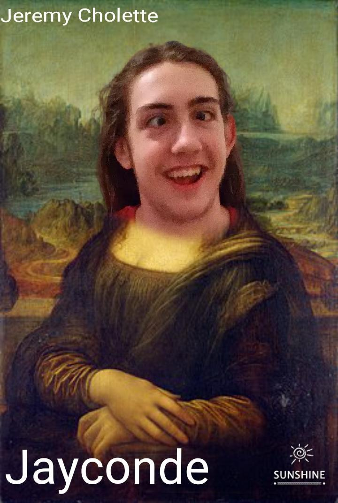
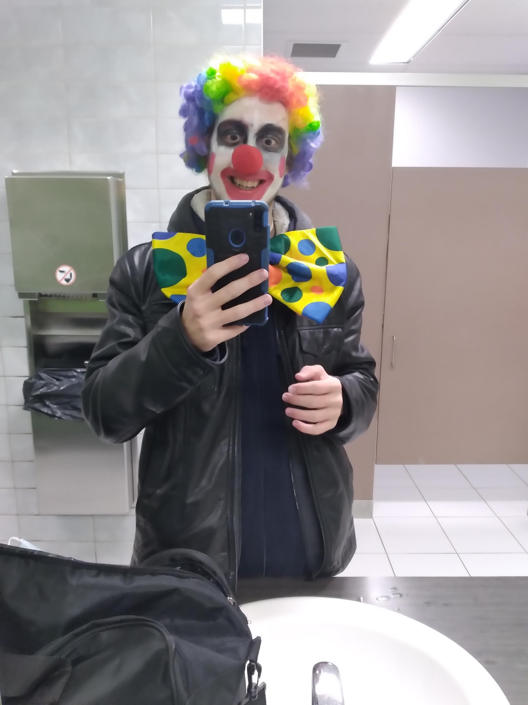
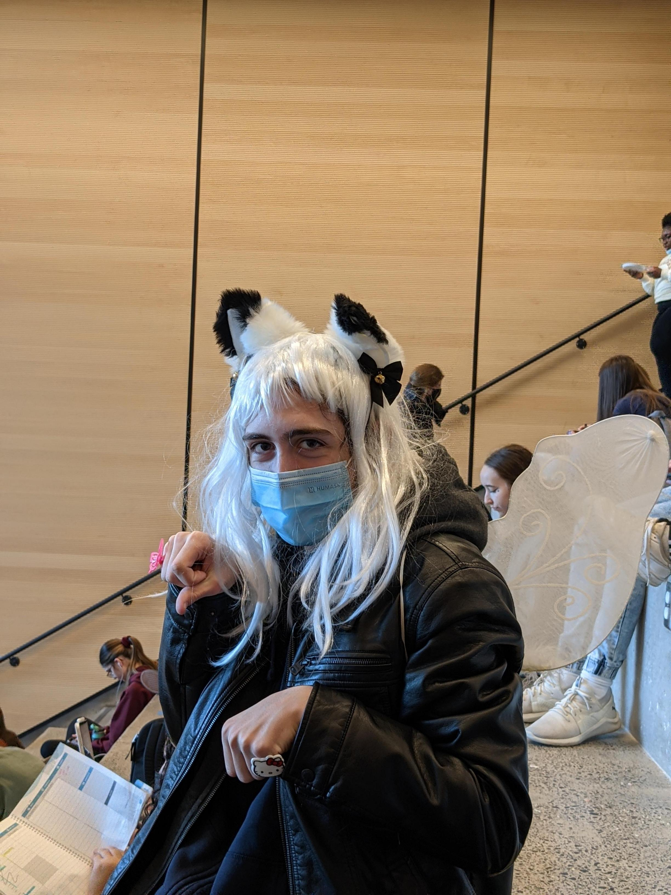

# Jérémy Cholette

Bonjour je me prénomme Jérémy Cholette. Je suis étudiant dans la technique d'intégration multimédia et c'est ma deuxième session. Le metier que je désire faire est l'animation 2D et 3D pour les jeux vidéo et les cartoons/anime. 

J'ai étudier en art et multimédia durant mon secondaire. 

Mes passe-temps sont variés. J'aime bien jouer aux jeux vidéo tels que league of legends ou super smash bros, j'aime aussi lire et dessiner, mais ce que je préfèere le plus faire c'est dormir.

Voici quelques un des projets que j'ai effectuer la session dernière

[photo](medias/dessin1.png)
[photo](medias/dessin2.png)
[photo](medias/dessin3.png)
[photo](medias/dessin4.png)
[photo](medias/dessin5.png)
